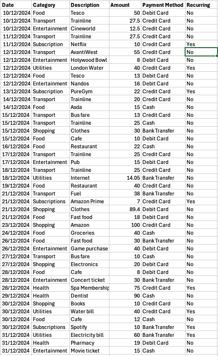
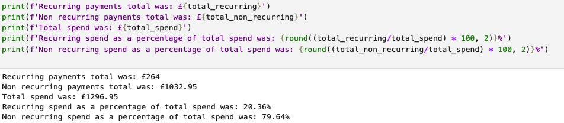
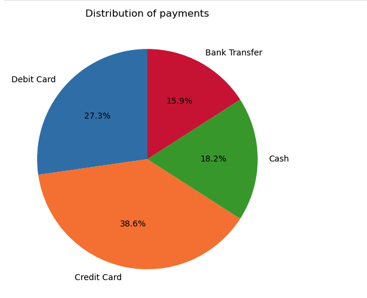

# excel_file_reader

Recurring Payments and Spending Analysis

Overview:
---------

This Jupyter Notebook reads data from an Excel file using openpyxl, processes recurring payments, and visualizes spending habits using pandas and matplotlib. The goal is to provide insights into recurring expenses and overall financial trends.

Features:
---------

 - Reads data from an Excel file (.xlsx) using openpyxl

 - Identifies recurring payments and categorizes expenses

 - Uses pandas for data manipulation and aggregation

 - Generates visualizations of spending habits with matplotlib

Prerequisites:
--------------

Ensure you have the following dependencies installed in your Python environment:

pip install pandas openpyxl matplotlib jupyterlab

Usage:
------

Open the Jupyter Notebook.

Ensure the Excel file containing financial data is in the correct directory.

Example Excel Data File below:
------------------------------

Run the notebook cells to:
--------------------------

Load the data from the Excel file

Process data (in this instance a comparison for recurring payments)

Generate visualizations of spending trends

Example of trends generated from file:
--------------------------------------

The notebook generates various graphs, such as:
-----------------------------------------------

Bar Chart: Monthly spending per category

Pie Chart: Distribution of expenses

Line Graph: Trends in recurring payments

Example Graph:
--------------

You can modify the notebook to:
-------------------------------

 - Use different excel files for weekly, monthly, or yearly spending

 - Use different data points to analyse

 - Change spending categories

 - Filter specific transactions
   

License:
--------

This project is open-source under the MIT License.
